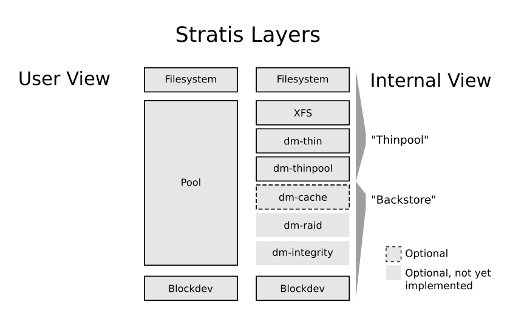

# oVirt & RHEV

## Configuring Storage


Setting up storage is a prerequisite for a new data center because a data center cannot be initialized unless storage domains are attached and activated. As a Red Hat Virtualization system administrator, you need to create, configure, attach and maintain storage for the virtualized enterprise.


Red Hat Virtualization has three types of **storage domains**:

* **Data Domain**: holds the virtual hard disks and OVF files of all the virtual machines and templates in a data center. In addition, snapshots of the virtual machines are also stored in the data domain. The data domain cannot be shared across data centers. Data domains of multiple types \(iSCSI, NFS, FC, POSIX, and Gluster\) can be added to the same data center, provided they are all shared, rather than local, domains._You must attach a data domain to a data center before you can attach domains of other types to it_.
* **ISO Domain**: store ISO files \(or logical CDs\) used to install and boot operating systems and applications for the virtual machines. An ISO domain removes the data center’s need for physical media. An ISO domain can be shared across different data centers. ISO domains can only be NFS-based. Only one ISO domain can be added to a data center.
* **Export Domain**: temporary storage repositories that are used to copy and move images between data centers and Red Hat Virtualization environments. Export domains can be used to backup virtual machines. An export domain can be moved between data centers, however, it can only be active in one data center at a time. Export domains can only be NFS-based. Only one export domain can be added to a data center.

### Storage Pools

From the perspective of the local operating system

### Block Storage with Stratis





### Step 1 - install Stratis

Stratis consists of two components.

**First**, the Stratis daemon, stratisd:

* manages collections of block devices
* provides a D-Bus API

**Second**, the Stratis command-line interface, stratis-cli:

* uses the D-Bus API to communicate with stratisd

To start off, install the **stratisd** and **stratis-cli** packages using a software package manager.

`yum -y install stratisd stratis-cli`

You can check the stratis-cli version.

`stratis --version`

```text
 2.1.1
```



### Step 2

#### Enable and Start the Stratis Daemon

Now, enable and start the stratisd systemd service using the `systemctl` utility.

`systemctl --now enable stratisd`

At any point, you may also check the status of stratisd.

`systemctl status stratisd --no-pager`

```text
 stratisd.service - A daemon that manages a pool of block devices to create flexible file systems
 Loaded: loaded (/usr/lib/systemd/system/stratisd.service; enabled; vendor preset: enabled)
 Active: active (running) since Thu 2020-05-07 15:11:21 EDT; 1s ago

<< OUTPUT ABRIDGED >>
```

If stratisd is running, you should see the Active: information report `active (running)` as it is shown in the above output from the `systemctl status` command.

Additionally, you can connect to the running daemon and have it report its version.

`stratis daemon version`

```text
 2.1.0
```

In the above output, the daemon reports that the version of stratisd is 2.0.0.



### Step 3

#### Locate Empty Block Devices

A block storage device \(or block device\) is a device that can read and write data in “blocks” of a given size. You will need to obtain empty block devices for this tutorial.

To do that, first use the `lsblk` utility to view a list of block devices on your machine.

`lsblk`

```text
NAME          MAJ:MIN RM  SIZE RO TYPE MOUNTPOINT
sr0            11:0    1  7.3G  0 rom
vda           252:0    0 39.1G  0 disk
├─vda1        252:1    0    1G  0 part /boot
└─vda2        252:2    0 38.1G  0 part
  ├─rhel-root 253:0    0 34.2G  0 lvm  /
  └─rhel-swap 253:1    0  3.9G  0 lvm  [SWAP]
```

From the above output, you can see that the two existing block devices on the machine, /dev/vda1 and /dev/vda2, are currently in use for /boot and logical volumes rhel-root and rhel-swap, respectively.

Therefore, in this lab, you will instead create a 10 GiB file within the existing root filesystem and access that space through the looback interface.

`truncate -s 10g /tmp/myfile.trunc`

`losetup /dev/loop1 /tmp/myfile.trunc`

Verify that the loopback device has been created.

`lsblk`

```text
 NAME          MAJ:MIN RM  SIZE RO TYPE MOUNTPOINT
 loop1           7:1    0   10G  0 loop
 sr0            11:0    1  7.3G  0 rom
 vda           252:0    0 39.1G  0 disk
 ├─vda1        252:1    0    1G  0 part /boot
 └─vda2        252:2    0 38.1G  0 part
   ├─rhel-root 253:0    0 34.2G  0 lvm  /
   └─rhel-swap 253:1    0  3.9G  0 lvm  [SWAP]
```

From the above output, you can see that loop1 is now listed as a newly created block device.

Create one more block device for this lab.

`truncate -s 10g /tmp/myfile2.trunc`

`losetup /dev/loop2 /tmp/myfile2.trunc`

Check that the two devices are displayed.

`lsblk`

```text
 NAME          MAJ:MIN RM  SIZE RO TYPE MOUNTPOINT
 loop1           7:1    0   10G  0 loop
 loop2           7:2    0   10G  0 loop

<< OUTPUT ABRIDGED >>
```

You should now see loop1 and loop2 devices reported in the output of `lsblk`. These correspond to the two loopback device you configured with the `losetup` command. When these block devices are written to, the data will be stored in the /tmp/myfile1.trunc and /tmp/myfile2.truc files backing these loopback block devices.



### Step 4

#### Create a Storage Pool

A pool is a quantity of storage set aside by an administrator. A Stratis pool is created from one or more block devices. All pools must have a name; you can name the pool **my\_pool**.

Create my\_pool from the block device that you just identified, /dev/loop1.

`stratis pool create my_pool /dev/loop1`

If you run blkid, you can see that /dev/loop1 is now in use and that its type is "stratis".

`blkid`

```text
 << OUTPUT ABRIDGED >>

 /dev/loop1: UUID="e28d5230c62349ae954c73373ffaca50" POOL_UUID="f2dd9526bc2a4653a431f322ed85b0f5" BLOCKDEV_SECTORS="20971520" BLOCKDEV_INITTIME="1588558543" TYPE="stratis"
```

The other loopback device is not in use, and therefore is not listed.

`stratis pool list`

```text
Name                     Total Physical   Properties
my_pool   10 GiB / 37.63 MiB / 9.96 GiB      ~Ca,~Cr
```

You should see my\_pool listed.

> **NOTE:** `stratis pool list` will provide you with a list of any storage pools created on the system using stratis.



### Step 5

#### Add a block device to an existing pool

All pools contain a data tier, which contains one or more block devices used to store data. The block devices used to create the pool belong to the pool's data tier.

You can add additional block devices to a pool as data devices, thereby increasing the disk space provided to the Stratis pool. This is helpful when you have exhaused the available space initially allocated to the pool.

The pool you created, my\_pool, has 10 GiB of space. Add /dev/loop2 as a data device to my\_pool.

`stratis pool add-data my_pool /dev/loop2`

Now list the pools.

`stratis pool list`

```text
Name                      Total Physical   Properties
my_pool   20 GiB / 41.64 MiB / 19.96 GiB      ~Ca,~Cr
```

You should see that my\_pool now has a size of 20 GiB.

#### List block devices

Now that the pool consists of multiple block devices, it may be useful to find out which block devices belong to which pools.

`stratis blockdev list`

```text
 Pool Name  Device Node  Physical Size  Tier
 my_pool    /dev/loop1          10 GiB  Data
 my_pool    /dev/loop2          10 GiB  Data
```

You can see that both /dev/loop1 and /dev/loop2 belong to my\_pool.  



### Step 6

#### Create a File System

A filesystem is a hierarchy of directories that is used to organize files on a storage media. Multiple Stratis filesystems may be created from a pool. Like pools, all filesystems must have a name; you can name the filesystem **my\_first\_fs**.

Create my\_first\_fs from the pool that you created, my\_pool.

`stratis filesystem create my_pool my_first_fs`

#### List filesystems

At any point, you may list all existing Stratis filesystems.

`stratis filesystem list`

```text
 Pool Name  Name         Used     Created            Device                        UUID
 my_pool    my_first_fs  546 MiB  May 07 2020 14:55  /stratis/my_pool/my_first_fs  e2688231488f40808507ede7502aad01
```

You can see the new filesystem, my\_first\_fs, listed with the corresponding pool and additional information.

> **NOTE:** There is a shorter version of the filesystem listing command: `stratis fs`

`stratis fs`

#### Rename a filesystem

It is possible to rename a filesystem. This may be useful for a variety of reasons, such as updating the name of a test filesystem to a production ready name.

Rename my\_first\_fs to a new name, my\_fs.

`stratis filesystem rename my_pool my_first_fs my_fs`

A filesystem list command will now yield the filesystem with its new name:

`stratis fs`

```text
 Pool Name  Name   Used     Created            Device                  UUID
 my_pool    my_fs  546 MiB  May 07 2020 14:55  /stratis/my_pool/my_fs  e2688231488f40808507ede7502aad01
```

The filesystem is now listed as my\_fs under the Name column.



### Step 7

#### Mount a Filesystem

Mounting a filesystem means making the particular filesystem accessible at a certain point in the Linux directory tree. Your filesystem is unmounted, and cannot be used to store, read from, or write to files.

Choose a mount point, the directory in which the filesystem will be mounted. You will mount the filesystem, my\_fs, in the directory /mnt/test\_mnt

`mkdir /mnt/test_mnt`

Mount the filesystem using the `mount` command.

`mount /stratis/my_pool/my_fs /mnt/test_mnt`

The mount point, /mnt/test\_mnt, will now be the root directory of the filesystem.

> **Warning:** If you do not choose an empty directory, the directory's previous contents will become hidden until the filesystem is unmounted.

Confirm that the filesystem has been mounted by running the mount command.

`mount`

```text
 << OUTPUT ABRIDGED >>

 /dev/mapper/stratis-1-ab995c9fa31e43a281322465a744c911-thin-fs-0f808d165a264b779cb9108f7176c098 on /mnt/test_mnt type xfs (rw,relatime,seclabel,attr2,inode64,sunit=2048,swidth=2048,noquota)
```

From the above output, you can see that the filesystem is now mounted successfully in the /mnt/test\_mnt directory.

#### Create files on mounted filesystem

Create two empty files in the filesystem, my\_fs.

`touch /mnt/test_mnt/my_first_file`

`touch /mnt/test_mnt/my_second_file`

Check that the files have been created.

`ls /mnt/test_mnt`

```text
 my_first_file  my_second_file
```

Both files are now accessible in the /mnt/test\_mnt directory.



### Step 8

#### Create a Snapshot

A snapshot of a filesystem is a read/writeable thinly provisioned point in time copy of the source filesystem. To create a snapshot, you will need the name of the pool in which the filesystem is located, the name of the filesystem, and the name of the snapshot of the filesystem.

Create a snapshot of the filesystem. Name the snapshot **my\_snapshot**.

`stratis filesystem snapshot my_pool my_fs my_snapshot`

Check that the snapshot was created successfully by listing the stratis filesystems.

`stratis fs`

```text
 Pool Name  Name         Used     Created            Device                        UUID
 my_pool    my_fs        546 MiB  May 08 2020 12:19  /stratis/my_pool/my_fs        0f808d165a264b779cb9108f7176c098
 my_pool    my_snapshot  546 MiB  May 08 2020 12:29  /stratis/my_pool/my_snapshot  cf5ac541bb7440a9b1cf5b2ebe936f05
```

You should see my\_snapshot listed in the output.

#### Access the snapshot to recover files

Here is an example of how a snapshot can be used to recover deleted files from a filesystem.

Delete the first file that you created in the previous step.

`rm -f /mnt/test_mnt/my_first_file`

Check that my\_first\_file has been deleted.

`ls /mnt/test_mnt`

```text
 my_second_file
```

You can see that my\_first\_file has been removed from the directory, and only my\_second\_file remains.

You can now mount the snapshot and get access to both files, since the snapshot was created before the file was deleted. First, create a new mountpoint to attach the snapshot into the filesystem, /mnt/test\_mnt\_snap.

`mkdir /mnt/test_mnt_snap`

Next, mount the snapshot, my\_snapshot.

`mount /stratis/my_pool/my_snapshot /mnt/test_mnt_snap`

Confirm that the snapshot was mounted successfully.

`mount`

```text
 << OUTPUT ABRIDGED >>
 /dev/mapper/stratis-1-ab995c9fa31e43a281322465a744c911-thin-fs-cf5ac541bb7440a9b1cf5b2ebe936f05 on /mnt/test_mnt_snap type xfs (rw,relatime,seclabel,attr2,inode64,sunit=2048,swidth=2048,noquota)
```

From the output above, the snapshot is mounted on /mnt/test\_mnt\_snap.

List the files stored within the snapshot on /mnt/test\_mnt\_snap.

`ls /mnt/test_mnt_snap`

```text
 my_first_file  my_second_file
```

Both files are listed!

#### Copy the file back to the original filesystem

Now that you have access to the previously deleted file, my\_first\_file, you may want to copy it back into the original filesystem, my\_fs.

To do this, copy the file, my\_first\_file back into the original filesytem.

`cp /mnt/test_mnt_snap/my_first_file /mnt/test_mnt`

Lastly, confirm that my\_first\_file has been copied to /mnt/test\_mnt.

`ls /mnt/test_mnt`

```text
 my_first_file my_second_file
```

The filesystem, my\_fs, now contains the previously deleted file, my\_first\_file.



```text
[root@7d093246618a ~]# yum -y install stratisd stratis-cli
Updating Subscription Management repositories.
Red Hat Enterprise Linux 8 for x86_64 - BaseOS (RPMs)                38 MB/s |  26 MB     00:00
Red Hat Enterprise Linux 8 for x86_64 - AppStream (RPMs)             24 MB/s |  25 MB     00:01
Dependencies resolved.
====================================================================================================
 Package                           Arch    Version          Repository                         Size
====================================================================================================
Installing:
 stratis-cli                       noarch  2.1.1-6.el8      rhel-8-for-x86_64-appstream-rpms   75 k
 stratisd                          x86_64  2.1.0-1.el8      rhel-8-for-x86_64-appstream-rpms  1.4 M
Installing dependencies:
 cryptsetup                        x86_64  2.3.3-2.el8      rhel-8-for-x86_64-baseos-rpms     189 k
 keyutils                          x86_64  1.5.10-6.el8     rhel-8-for-x86_64-baseos-rpms      63 k
 python3-dbus-client-gen           noarch  0.4-1.el8        rhel-8-for-x86_64-appstream-rpms   26 k
 python3-dbus-python-client-gen    noarch  0.7-3.el8        rhel-8-for-x86_64-appstream-rpms   28 k
 python3-dbus-signature-pyparsing  noarch  0.03-2.el8       rhel-8-for-x86_64-appstream-rpms   19 k
 python3-into-dbus-python          noarch  0.06-2.el8       rhel-8-for-x86_64-appstream-rpms   27 k
 python3-justbases                 noarch  0.14-4.el8       rhel-8-for-x86_64-appstream-rpms   46 k
 python3-justbytes                 noarch  0.14-2.el8       rhel-8-for-x86_64-appstream-rpms   43 k
 python3-psutil                    x86_64  5.4.3-10.el8     rhel-8-for-x86_64-appstream-rpms  373 k
 python3-pyparsing                 noarch  2.1.10-7.el8     rhel-8-for-x86_64-baseos-rpms     142 k
 python3-semantic_version          noarch  2.6.0-5.el8      rhel-8-for-x86_64-appstream-rpms   30 k

Transaction Summary
====================================================================================================
Install  13 Packages

Total download size: 2.4 M
Installed size: 8.3 M
Downloading Packages:
(1/13): keyutils-1.5.10-6.el8.x86_64.rpm                            233 kB/s |  63 kB     00:00
(2/13): cryptsetup-2.3.3-2.el8.x86_64.rpm                           631 kB/s | 189 kB     00:00
(3/13): python3-pyparsing-2.1.10-7.el8.noarch.rpm                   456 kB/s | 142 kB     00:00
(4/13): python3-dbus-signature-pyparsing-0.03-2.el8.noarch.rpm       76 kB/s |  19 kB     00:00
(5/13): python3-dbus-client-gen-0.4-1.el8.noarch.rpm                119 kB/s |  26 kB     00:00
(6/13): python3-semantic_version-2.6.0-5.el8.noarch.rpm             138 kB/s |  30 kB     00:00
(7/13): python3-psutil-5.4.3-10.el8.x86_64.rpm                      1.8 MB/s | 373 kB     00:00
(8/13): python3-dbus-python-client-gen-0.7-3.el8.noarch.rpm         140 kB/s |  28 kB     00:00
(9/13): python3-into-dbus-python-0.06-2.el8.noarch.rpm              103 kB/s |  27 kB     00:00
(10/13): stratisd-2.1.0-1.el8.x86_64.rpm                            5.9 MB/s | 1.4 MB     00:00
(11/13): stratis-cli-2.1.1-6.el8.noarch.rpm                         304 kB/s |  75 kB     00:00
(12/13): python3-justbases-0.14-4.el8.noarch.rpm                    210 kB/s |  46 kB     00:00
(13/13): python3-justbytes-0.14-2.el8.noarch.rpm                    174 kB/s |  43 kB     00:00
----------------------------------------------------------------------------------------------------
Total                                                               2.0 MB/s | 2.4 MB     00:01
Running transaction check
Transaction check succeeded.
Running transaction test
Transaction test succeeded.
Running transaction
  Preparing        :                                                                            1/1
  Installing       : python3-justbases-0.14-4.el8.noarch                                       1/13
  Installing       : python3-justbytes-0.14-2.el8.noarch                                       2/13
  Installing       : python3-psutil-5.4.3-10.el8.x86_64                                        3/13
  Installing       : python3-semantic_version-2.6.0-5.el8.noarch                               4/13
  Installing       : python3-dbus-client-gen-0.4-1.el8.noarch                                  5/13
  Installing       : cryptsetup-2.3.3-2.el8.x86_64                                             6/13
  Installing       : stratisd-2.1.0-1.el8.x86_64                                               7/13
  Running scriptlet: stratisd-2.1.0-1.el8.x86_64                                               7/13
  Installing       : python3-pyparsing-2.1.10-7.el8.noarch                                     8/13
  Installing       : python3-dbus-signature-pyparsing-0.03-2.el8.noarch                        9/13
  Installing       : python3-into-dbus-python-0.06-2.el8.noarch                               10/13
  Installing       : python3-dbus-python-client-gen-0.7-3.el8.noarch                          11/13
  Installing       : keyutils-1.5.10-6.el8.x86_64                                             12/13
  Installing       : stratis-cli-2.1.1-6.el8.noarch                                           13/13
  Running scriptlet: stratis-cli-2.1.1-6.el8.noarch                                           13/13
  Verifying        : keyutils-1.5.10-6.el8.x86_64                                              1/13
  Verifying        : python3-pyparsing-2.1.10-7.el8.noarch                                     2/13
  Verifying        : cryptsetup-2.3.3-2.el8.x86_64                                             3/13
  Verifying        : python3-dbus-signature-pyparsing-0.03-2.el8.noarch                        4/13
  Verifying        : python3-dbus-client-gen-0.4-1.el8.noarch                                  5/13
  Verifying        : python3-semantic_version-2.6.0-5.el8.noarch                               6/13
  Verifying        : python3-into-dbus-python-0.06-2.el8.noarch                                7/13
  Verifying        : python3-psutil-5.4.3-10.el8.x86_64                                        8/13
  Verifying        : python3-dbus-python-client-gen-0.7-3.el8.noarch                           9/13
  Verifying        : stratis-cli-2.1.1-6.el8.noarch                                           10/13
  Verifying        : stratisd-2.1.0-1.el8.x86_64                                              11/13
  Verifying        : python3-justbases-0.14-4.el8.noarch                                      12/13
  Verifying        : python3-justbytes-0.14-2.el8.noarch                                      13/13
Installed products updated.

Installed:
  cryptsetup-2.3.3-2.el8.x86_64
  keyutils-1.5.10-6.el8.x86_64
  python3-dbus-client-gen-0.4-1.el8.noarch
  python3-dbus-python-client-gen-0.7-3.el8.noarch
  python3-dbus-signature-pyparsing-0.03-2.el8.noarch
  python3-into-dbus-python-0.06-2.el8.noarch
  python3-justbases-0.14-4.el8.noarch
  python3-justbytes-0.14-2.el8.noarch
  python3-psutil-5.4.3-10.el8.x86_64
  python3-pyparsing-2.1.10-7.el8.noarch
  python3-semantic_version-2.6.0-5.el8.noarch
  stratis-cli-2.1.1-6.el8.noarch
  stratisd-2.1.0-1.el8.x86_64

Complete!
[root@7d093246618a ~]# stratis --version
2.1.1
[root@7d093246618a ~]# systemctl --now enable stratisd
[root@7d093246618a ~]# systemctl status stratisd --no-pager
● stratisd.service - Stratis daemon
   Loaded: loaded (/usr/lib/systemd/system/stratisd.service; enabled; vendor preset: enabled)
   Active: active (running) since Sun 2020-12-20 21:55:43 EST; 1s ago
     Docs: man:stratisd(8)
 Main PID: 2163 (stratisd)
    Tasks: 1 (limit: 11379)
   Memory: 1.2M
   CGroup: /system.slice/stratisd.service
           └─2163 /usr/libexec/stratisd --debug

Dec 20 21:55:43 7d093246618a systemd[1]: Started Stratis daemon.
Dec 20 21:55:43 7d093246618a stratisd[2163]: DEBUG libstratis::stratis::buff_log: BuffLogger: … none
Dec 20 21:55:43 7d093246618a stratisd[2163]:  INFO stratisd: stratis daemon version 2.1.0 started
Dec 20 21:55:43 7d093246618a stratisd[2163]:  INFO stratisd: Using StratEngine
Dec 20 21:55:43 7d093246618a stratisd[2163]:  INFO libstratis::engine::strat_engine::backstore…vices
Dec 20 21:55:43 7d093246618a stratisd[2163]:  INFO stratisd: D-Bus API is available
Hint: Some lines were ellipsized, use -l to show in full.
[root@7d093246618a ~]# stratis daemon version
2.1.0
[root@7d093246618a ~]# lsblk
NAME          MAJ:MIN RM  SIZE RO TYPE MOUNTPOINT
sr0            11:0    1  8.8G  0 rom
vda           252:0    0 39.1G  0 disk
├─vda1        252:1    0    1G  0 part /boot
└─vda2        252:2    0 38.1G  0 part
  ├─rhel-root 253:0    0 34.2G  0 lvm  /
  └─rhel-swap 253:1    0  3.9G  0 lvm  [SWAP]
[root@7d093246618a ~]# truncate -s 10g /tmp/myfile.trunc
[root@7d093246618a ~]# losetup /dev/loop1 /tmp/myfile.trunc
[root@7d093246618a ~]# lsblk
NAME          MAJ:MIN RM  SIZE RO TYPE MOUNTPOINT
loop1           7:1    0   10G  0 loop
sr0            11:0    1  8.8G  0 rom
vda           252:0    0 39.1G  0 disk
├─vda1        252:1    0    1G  0 part /boot
└─vda2        252:2    0 38.1G  0 part
  ├─rhel-root 253:0    0 34.2G  0 lvm  /
  └─rhel-swap 253:1    0  3.9G  0 lvm  [SWAP]
[root@7d093246618a ~]# truncate -s 10g /tmp/myfile2.trunc
[root@7d093246618a ~]# losetup /dev/loop2 /tmp/myfile2.trunc
[root@7d093246618a ~]# lsblk
NAME          MAJ:MIN RM  SIZE RO TYPE MOUNTPOINT
loop1           7:1    0   10G  0 loop
loop2           7:2    0   10G  0 loop
sr0            11:0    1  8.8G  0 rom
vda           252:0    0 39.1G  0 disk
├─vda1        252:1    0    1G  0 part /boot
└─vda2        252:2    0 38.1G  0 part
  ├─rhel-root 253:0    0 34.2G  0 lvm  /
  └─rhel-swap 253:1    0  3.9G  0 lvm  [SWAP]
[root@7d093246618a ~]# stratis pool create my_pool /dev/loop1
[root@7d093246618a ~]# blkid
/dev/vda1: UUID="a2295d86-4e10-4f36-94b9-6c01ae058153" BLOCK_SIZE="512" TYPE="xfs" PARTUUID="58872f0d-01"
/dev/vda2: UUID="XelkCA-pCa3-vzGT-wgqn-0Hgm-vWrG-HMJe5x" TYPE="LVM2_member" PARTUUID="58872f0d-02"
/dev/sr0: BLOCK_SIZE="2048" UUID="2020-10-09-06-40-37-00" LABEL="RHEL-8-3-0-BaseOS-x86_64" TYPE="iso9660" PTUUID="4c667155" PTTYPE="dos"
/dev/mapper/rhel-root: UUID="be100575-0fb1-4764-b610-89bd04fdddc0" BLOCK_SIZE="512" TYPE="xfs"
/dev/mapper/rhel-swap: UUID="4c3549f5-c9c3-4da7-b270-baef45b1a375" TYPE="swap"
/dev/loop1: UUID="adf67821f77245249dec7b8d4817f371" POOL_UUID="bc50613663a54226920b471090cd2874" BLOCKDEV_SECTORS="20971520" BLOCKDEV_INITTIME="1608519372" TYPE="stratis"
[root@7d093246618a ~]# stratis pool list
Name                     Total Physical   Properties
my_pool   10 GiB / 37.63 MiB / 9.96 GiB      ~Ca,~Cr
[root@7d093246618a ~]# stratis pool list
Name                     Total Physical   Properties
my_pool   10 GiB / 37.63 MiB / 9.96 GiB      ~Ca,~Cr
[root@7d093246618a ~]# stratis pool add-data my_pool /dev/loop2
[root@7d093246618a ~]# stratis pool list
Name                      Total Physical   Properties
my_pool   20 GiB / 41.64 MiB / 19.96 GiB      ~Ca,~Cr
[root@7d093246618a ~]# stratis blockdev list
Pool Name   Device Node   Physical Size   Tier
my_pool     /dev/loop1           10 GiB   Data
my_pool     /dev/loop2           10 GiB   Data
[root@7d093246618a ~]# stratis filesystem create my_pool my_first_fs
[root@7d093246618a ~]# stratis filesystem list
Pool Name   Name          Used      Created             Device                         UUID
my_pool     my_first_fs   546 MiB   Dec 20 2020 21:58   /stratis/my_pool/my_first_fs   7ae2fb84cee243b59c94c80323a7873e
[root@7d093246618a ~]# stratis fs
Pool Name   Name          Used      Created             Device                         UUID
my_pool     my_first_fs   546 MiB   Dec 20 2020 21:58   /stratis/my_pool/my_first_fs   7ae2fb84cee243b59c94c80323a7873e
[root@7d093246618a ~]# stratis filesystem rename my_pool my_first_fs my_fs
[root@7d093246618a ~]# stratis fs
Pool Name   Name    Used      Created             Device                   UUID
my_pool     my_fs   546 MiB   Dec 20 2020 21:58   /stratis/my_pool/my_fs   7ae2fb84cee243b59c94c80323a7873e
[root@7d093246618a ~]# mkdir /mnt/test_mnt
[root@7d093246618a ~]# mount /stratis/my_pool/my_fs /mnt/test_mnt
[root@7d093246618a ~]# mount
sysfs on /sys type sysfs (rw,nosuid,nodev,noexec,relatime,seclabel)
proc on /proc type proc (rw,nosuid,nodev,noexec,relatime)
devtmpfs on /dev type devtmpfs (rw,nosuid,seclabel,size=910412k,nr_inodes=227603,mode=755)
securityfs on /sys/kernel/security type securityfs (rw,nosuid,nodev,noexec,relatime)
tmpfs on /dev/shm type tmpfs (rw,nosuid,nodev,seclabel)
devpts on /dev/pts type devpts (rw,nosuid,noexec,relatime,seclabel,gid=5,mode=620,ptmxmode=000)
tmpfs on /run type tmpfs (rw,nosuid,nodev,seclabel,mode=755)
tmpfs on /sys/fs/cgroup type tmpfs (ro,nosuid,nodev,noexec,seclabel,mode=755)
cgroup on /sys/fs/cgroup/systemd type cgroup (rw,nosuid,nodev,noexec,relatime,seclabel,xattr,release_agent=/usr/lib/systemd/systemd-cgroups-agent,name=systemd)
pstore on /sys/fs/pstore type pstore (rw,nosuid,nodev,noexec,relatime,seclabel)
bpf on /sys/fs/bpf type bpf (rw,nosuid,nodev,noexec,relatime,mode=700)
cgroup on /sys/fs/cgroup/cpu,cpuacct type cgroup (rw,nosuid,nodev,noexec,relatime,seclabel,cpu,cpuacct)
cgroup on /sys/fs/cgroup/net_cls,net_prio type cgroup (rw,nosuid,nodev,noexec,relatime,seclabel,net_cls,net_prio)
cgroup on /sys/fs/cgroup/hugetlb type cgroup (rw,nosuid,nodev,noexec,relatime,seclabel,hugetlb)
cgroup on /sys/fs/cgroup/devices type cgroup (rw,nosuid,nodev,noexec,relatime,seclabel,devices)
cgroup on /sys/fs/cgroup/cpuset type cgroup (rw,nosuid,nodev,noexec,relatime,seclabel,cpuset)
cgroup on /sys/fs/cgroup/blkio type cgroup (rw,nosuid,nodev,noexec,relatime,seclabel,blkio)
cgroup on /sys/fs/cgroup/perf_event type cgroup (rw,nosuid,nodev,noexec,relatime,seclabel,perf_event)
cgroup on /sys/fs/cgroup/freezer type cgroup (rw,nosuid,nodev,noexec,relatime,seclabel,freezer)
cgroup on /sys/fs/cgroup/memory type cgroup (rw,nosuid,nodev,noexec,relatime,seclabel,memory)
cgroup on /sys/fs/cgroup/pids type cgroup (rw,nosuid,nodev,noexec,relatime,seclabel,pids)
cgroup on /sys/fs/cgroup/rdma type cgroup (rw,nosuid,nodev,noexec,relatime,seclabel,rdma)
none on /sys/kernel/tracing type tracefs (rw,relatime,seclabel)
configfs on /sys/kernel/config type configfs (rw,relatime)
/dev/mapper/rhel-root on / type xfs (rw,relatime,seclabel,attr2,inode64,logbufs=8,logbsize=32k,noquota)
selinuxfs on /sys/fs/selinux type selinuxfs (rw,relatime)
systemd-1 on /proc/sys/fs/binfmt_misc type autofs (rw,relatime,fd=30,pgrp=1,timeout=0,minproto=5,maxproto=5,direct,pipe_ino=14864)
hugetlbfs on /dev/hugepages type hugetlbfs (rw,relatime,seclabel,pagesize=2M)
mqueue on /dev/mqueue type mqueue (rw,relatime,seclabel)
debugfs on /sys/kernel/debug type debugfs (rw,relatime,seclabel)
/dev/vda1 on /boot type xfs (rw,relatime,seclabel,attr2,inode64,logbufs=8,logbsize=32k,noquota)
tmpfs on /run/user/0 type tmpfs (rw,nosuid,nodev,relatime,seclabel,size=186024k,mode=700)
/dev/mapper/stratis-1-bc50613663a54226920b471090cd2874-thin-fs-7ae2fb84cee243b59c94c80323a7873e on /mnt/test_mnt type xfs (rw,relatime,seclabel,attr2,inode64,logbufs=8,logbsize=32k,sunit=2048,swidth=2048,noquota)
[root@7d093246618a ~]# touch /mnt/test_mnt/my_first_file
[root@7d093246618a ~]# touch /mnt/test_mnt/my_second_file
[root@7d093246618a ~]# ls /mnt/test_mnt
my_first_file  my_second_file
[root@7d093246618a ~]# stratis filesystem snapshot my_pool my_fs my_snapshot
[root@7d093246618a ~]# stratis fs
Pool Name   Name          Used      Created             Device                         UUID
my_pool     my_fs         546 MiB   Dec 20 2020 21:58   /stratis/my_pool/my_fs         7ae2fb84cee243b59c94c80323a7873e
my_pool     my_snapshot   546 MiB   Dec 20 2020 22:02   /stratis/my_pool/my_snapshot   d0ed2e747d824939ab362c77fe33ceba
[root@7d093246618a ~]# rm -f /mnt/test_mnt/my_first_file
[root@7d093246618a ~]# ls /mnt/test_mnt
my_second_file
[root@7d093246618a ~]# mkdir /mnt/test_mnt_snap
[root@7d093246618a ~]# mount /stratis/my_pool/my_snapshot /mnt/test_mnt_snap
[root@7d093246618a ~]# mount
sysfs on /sys type sysfs (rw,nosuid,nodev,noexec,relatime,seclabel)
proc on /proc type proc (rw,nosuid,nodev,noexec,relatime)
devtmpfs on /dev type devtmpfs (rw,nosuid,seclabel,size=910412k,nr_inodes=227603,mode=755)
securityfs on /sys/kernel/security type securityfs (rw,nosuid,nodev,noexec,relatime)
tmpfs on /dev/shm type tmpfs (rw,nosuid,nodev,seclabel)
devpts on /dev/pts type devpts (rw,nosuid,noexec,relatime,seclabel,gid=5,mode=620,ptmxmode=000)
tmpfs on /run type tmpfs (rw,nosuid,nodev,seclabel,mode=755)
tmpfs on /sys/fs/cgroup type tmpfs (ro,nosuid,nodev,noexec,seclabel,mode=755)
cgroup on /sys/fs/cgroup/systemd type cgroup (rw,nosuid,nodev,noexec,relatime,seclabel,xattr,release_agent=/usr/lib/systemd/systemd-cgroups-agent,name=systemd)
pstore on /sys/fs/pstore type pstore (rw,nosuid,nodev,noexec,relatime,seclabel)
bpf on /sys/fs/bpf type bpf (rw,nosuid,nodev,noexec,relatime,mode=700)
cgroup on /sys/fs/cgroup/cpu,cpuacct type cgroup (rw,nosuid,nodev,noexec,relatime,seclabel,cpu,cpuacct)
cgroup on /sys/fs/cgroup/net_cls,net_prio type cgroup (rw,nosuid,nodev,noexec,relatime,seclabel,net_cls,net_prio)
cgroup on /sys/fs/cgroup/hugetlb type cgroup (rw,nosuid,nodev,noexec,relatime,seclabel,hugetlb)
cgroup on /sys/fs/cgroup/devices type cgroup (rw,nosuid,nodev,noexec,relatime,seclabel,devices)
cgroup on /sys/fs/cgroup/cpuset type cgroup (rw,nosuid,nodev,noexec,relatime,seclabel,cpuset)
cgroup on /sys/fs/cgroup/blkio type cgroup (rw,nosuid,nodev,noexec,relatime,seclabel,blkio)
cgroup on /sys/fs/cgroup/perf_event type cgroup (rw,nosuid,nodev,noexec,relatime,seclabel,perf_event)
cgroup on /sys/fs/cgroup/freezer type cgroup (rw,nosuid,nodev,noexec,relatime,seclabel,freezer)
cgroup on /sys/fs/cgroup/memory type cgroup (rw,nosuid,nodev,noexec,relatime,seclabel,memory)
cgroup on /sys/fs/cgroup/pids type cgroup (rw,nosuid,nodev,noexec,relatime,seclabel,pids)
cgroup on /sys/fs/cgroup/rdma type cgroup (rw,nosuid,nodev,noexec,relatime,seclabel,rdma)
none on /sys/kernel/tracing type tracefs (rw,relatime,seclabel)
configfs on /sys/kernel/config type configfs (rw,relatime)
/dev/mapper/rhel-root on / type xfs (rw,relatime,seclabel,attr2,inode64,logbufs=8,logbsize=32k,noquota)
selinuxfs on /sys/fs/selinux type selinuxfs (rw,relatime)
systemd-1 on /proc/sys/fs/binfmt_misc type autofs (rw,relatime,fd=30,pgrp=1,timeout=0,minproto=5,maxproto=5,direct,pipe_ino=14864)
hugetlbfs on /dev/hugepages type hugetlbfs (rw,relatime,seclabel,pagesize=2M)
mqueue on /dev/mqueue type mqueue (rw,relatime,seclabel)
debugfs on /sys/kernel/debug type debugfs (rw,relatime,seclabel)
/dev/vda1 on /boot type xfs (rw,relatime,seclabel,attr2,inode64,logbufs=8,logbsize=32k,noquota)
tmpfs on /run/user/0 type tmpfs (rw,nosuid,nodev,relatime,seclabel,size=186024k,mode=700)
/dev/mapper/stratis-1-bc50613663a54226920b471090cd2874-thin-fs-7ae2fb84cee243b59c94c80323a7873e on /mnt/test_mnt type xfs (rw,relatime,seclabel,attr2,inode64,logbufs=8,logbsize=32k,sunit=2048,swidth=2048,noquota)
/dev/mapper/stratis-1-bc50613663a54226920b471090cd2874-thin-fs-d0ed2e747d824939ab362c77fe33ceba on /mnt/test_mnt_snap type xfs (rw,relatime,seclabel,attr2,inode64,logbufs=8,logbsize=32k,sunit=2048,swidth=2048,noquota)
[root@7d093246618a ~]# ls /mnt/test_mnt_snap
my_first_file  my_second_file
[root@7d093246618a ~]# cp /mnt/test_mnt_snap/my_first_file /mnt/test_mnt
[root@7d093246618a ~]# ls /mnt/test_mnt
my_first_file  my_second_file
```

